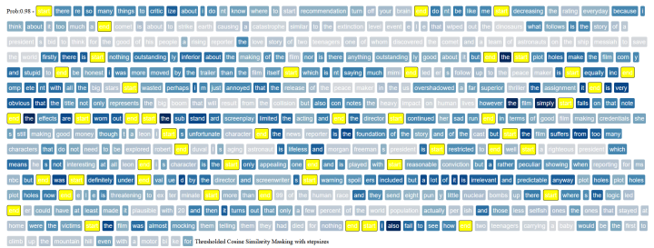
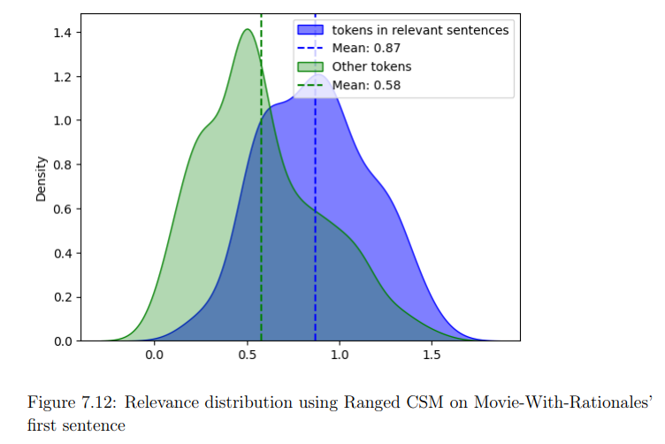
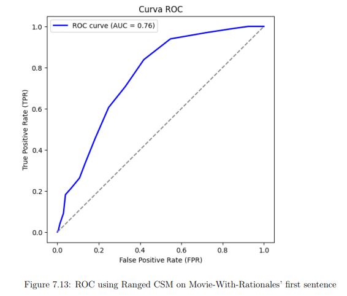

# transformers-explainability
A multi-method explainability framework for transformer-based text classification models.
It provides different XAI methods to create heatmaps that show which tokens are more relevant for the sake of the classification, and also uses the rationales (annotated ground truth) to evaluate the interpretation.

[comment]: <> (add paper reference in the previous sentence and in the general info)

## Table of Contents
* [General Info](#general-info)
* [Some results](#some-results)
* [Models](#models)
* [Datasets](#datasets)
* [Explanability Methods](#explainability-methods)
* [Technologies](#technologies)
* [Setup](#setup)
* [Authors](#authors)

## General info
This project is about explaining the choices made by text-classificators.
It includes a complete pipeline:

- Downloading data from Huggingface and Kagglehub
- Cleaning and preparing the 4 different datasets
- Fine-Tuning BERT and RoBERTa on the prediction tasks
- Applying the XAI methods to the classifications
- Comparing the explanation with the human annotated ground truth (so called rationales, part of the text annotated as relevant for the sake of the classification) and against already existing explanaiblity methods (SHAP,LIME)
- Producing visual plots of the explanations
- aggregate the performances of the XAI methods to compare them

Different methods to explain the choices of the model are implemented. 

[comment]: <> (More on that on the paper:)

## Some results

In this example, the first sentence of the movie reviews dataset (sentiment2) has been classified using the model and then interpreted using the Thresholded Cosine Similarity Masking method. The yellow placeholders, with the written words "start" and "end", mark each sentence that is part of the rationales.

 Also, the distribution of the relevance scores of the tokens can be plotted, taking in consideration of their annotated rationale (relevant/non relevant). As we can see, tokens annotated as relevant actually achived higher relevance score

The ROC curve is built considering the XAI method as a classifier that tries to predict if a token is relevant or not for the sake of the classification. Rationales are used as a ground truth.

## Models
The models used are BERT and RoBERTa:

- [BERT](https://huggingface.co/docs/transformers/model_doc/bert)
- [RoBERTa](https://huggingface.co/docs/transformers/model_doc/roberta)

## Datasets
The datasets are:

- [sentiment1](https://www.kaggle.com/datasets/madhavkumarchoudhary/sentiment-prediction-on-movie-reviews): a movie-reviews sentiment prediction dataset (positive/negative)
- [sentiment2](https://www.kaggle.com/datasets/thedevastator/unlocking-the-human-perspective-on-movie-reviews): a movie-reviews sentiment prediction dataset (positive/negative) with rationales (human-annotated parts of the review that are regarded as relevant for the sake of the classification)
- [asylex](https://huggingface.co/datasets/clairebarale/AsyLex/tree/main): a legal text dataset that contains:
    - legal court decision about:asylum requests: from this, the **asylex-outcome** dataset has been created. It is binary classification (accepted/rejected)
    - The annotated Nationality/Ethnicity/religion of the requester: from this,the **asylex-norp** dataset has been created. It is a multi label classification between different features of the requester

## Explainability Methods

Already existing methods:

- [SHAP](https://shap.readthedocs.io/en/latest/)
- [LIME](https://github.com/marcotcr/lime)

New methods:

- Persistent Homology (Angular Distance) and other Persistent Homology based methods
- Thresholded Cosine Similarity Masking and other Cosine Similarity based methods

## Technologies

This project runs using jupyter nb and the libraries indicated in the requirement txt.

## Setup

- Clone the repo
- Install the libraries indicated in requirements.txt
- start by running the main.jpynb cells in order, from the top to the bottom
- You will download, clean and prepare the datasets
- Using train_and_test.ipynb, create the classification model and save it in the correct folder
- Use the different XAI methods to interpret the model and plot the heatmaps

## Authors

- [@GiovanniBergami](https://www.github.com/GiovanniBergami)

